<p align="center">
  
  <h1 align="center">PaperCortex</h1>
  <p align="center">
    <strong>AI-Powered Document Intelligence for Paperless-ngx</strong><br/>
    <em>Semantic search, auto-classification, receipt extraction, and accounting export — 100% local, 100% private.</em>
  </p>
  <p align="center">
    <a href="#-quick-start"></a>
    <a href="LICENSE"></a>
    
    
    
    
    
    
  </p>
  <p align="center">
    <a href="#-quick-start">Quick Start</a> · <a href="#-features">Features</a> · <a href="#-mcp-server-tools">MCP Tools</a> · <a href="#-receipt-intelligence">Receipts</a> · <a href="#-documentation">Docs</a>
  </p>
</p>

<p align="center">
  
</p>

---

## What is PaperCortex?

**PaperCortex** turns your [Paperless-ngx](https://github.com/paperless-ngx/paperless-ngx) document archive into an intelligent, queryable knowledge base — powered entirely by local AI running on your own hardware.

If you use Paperless-ngx to store invoices, receipts, contracts, tax documents, letters, or any other scanned paperwork, PaperCortex adds the intelligence layer that Paperless-ngx is missing:

- **Ask questions in plain English** — "Show me all invoices from Amazon over 100 EUR in 2025"
- **Find documents by meaning**, not just keywords — searching for "office rent" finds "Bueromiete" and "monthly lease payment"
- **Auto-tag and classify** every new document the moment it arrives
- **Extract structured data from receipts** — vendor, date, amount, tax rate, line items
- **Match receipts to bank transactions** automatically
- **Export to DATEV** for your German tax advisor — or plain CSV for any accounting software

Everything runs locally through [Ollama](https://ollama.com). No document content ever leaves your network. No cloud APIs. No subscriptions. No data harvesting.

PaperCortex exposes all capabilities as an **[MCP (Model Context Protocol)](https://modelcontextprotocol.io) Server**, making it a first-class tool for [Claude Code](https://docs.anthropic.com/en/docs/claude-code), AI coding agents, and automated workflows.

---

## The Problem

Paperless-ngx is an outstanding document management system with 37,000+ GitHub stars. It handles scanning, OCR, storage, and basic tagging beautifully. But once your documents are in Paperless-ngx, finding and working with them has real limitations:

| What you want to do | Paperless-ngx alone | With PaperCortex |
|---|---|---|
| Find a document by what it's about | Keyword search only — misses synonyms, translations, related concepts | **Semantic search** understands meaning across languages |
| Classify incoming documents | Manual rules or basic auto-matching | **LLM-powered classification** understands document content |
| Extract data from a receipt | Read it yourself and type it in | **Automatic extraction** of vendor, amount, date, tax, line items |
| Answer "How much did I spend on X?" | Export everything, open spreadsheet, filter manually | **Natural language query** returns the answer instantly |
| Send receipt data to accounting | Manual data entry or copy-paste | **One-click DATEV/CSV export** ready for your tax advisor |
| Use documents in AI workflows | No API integration for AI agents | **Full MCP Server** for Claude Code and any MCP-compatible agent |
| Keep data private | Self-hosted (good!) | Self-hosted AI too — **zero cloud dependency** |

---

## Features

### Semantic Document Search

Traditional keyword search fails when you don't remember the exact words. PaperCortex generates vector embeddings for every document using local Ollama models and stores them in a lightweight SQLite vector database.

**Search by meaning, not by memory:**
- Search for `"electricity bill"` → finds documents containing "Stromrechnung", "utility payment", "power invoice"
- Search for `"office supplies"` → finds "Bueroausstattung", "paper and toner", "desk accessories order"
- Search for `"tax deductible travel"` → finds flight bookings, hotel receipts, train tickets, taxi invoices

**Supported embedding models:**
- `nomic-embed-text` (recommended — fast, accurate, 768 dimensions)
- `mxbai-embed-large` (higher accuracy, slower)
- Any Ollama-compatible embedding model

### Automatic Document Classification

Every new document arriving in Paperless-ngx gets analyzed by a local LLM that reads the OCR content and assigns:

- **Document type** — Invoice, Receipt, Contract, Letter, Statement, Tax Document, Certificate
- **Tags** — Contextual tags based on content (e.g., "office", "travel", "insurance", "subscription")
- **Correspondent** — Identifies the sender/vendor from document content
- **Date extraction** — Finds the document date (not just the scan date)
- **Language detection** — Identifies the document language

Classification runs asynchronously in the background. New documents are processed within minutes of arriving in Paperless-ngx.

### Receipt Intelligence

PaperCortex includes a dedicated receipt processing pipeline optimized for expense management:

**Data extraction from receipts and invoices:**
- Vendor / merchant name and address
- Date of purchase
- Total amount (gross and net)
- Tax rate and tax amount (supports multiple VAT rates)
- Currency
- Individual line items with quantities and prices
- Payment method
- Invoice/receipt number

**Works with:**
- Scanned paper receipts (via Paperless-ngx OCR)
- Digital PDF invoices
- Photographed receipts (mobile upload to Paperless-ngx)
- Multi-page invoices
- Receipts in German, English, French, Spanish, and other languages

### Bank Statement Matching

Import your bank statement as CSV and let PaperCortex automatically match transactions to receipts:

- **Fuzzy matching** on amount, date, and vendor name
- **Confidence scoring** — high/medium/low match indicators
- **Unmatched detection** — highlights receipts without matching transactions and vice versa
- **Multi-currency support** — handles EUR, USD, GBP, CHF, and 20+ currencies

### DATEV Export

For German businesses and freelancers, PaperCortex generates DATEV-compatible export files that your Steuerberater can import directly:

- **DATEV CSV format** (Buchungsstapel) — the standard German accounting import format
- **SKR03 / SKR04** account mapping
- **Automatic account assignment** based on document classification
- **Beleglink** — links each DATEV entry back to the original document in Paperless-ngx
- **Period exports** — monthly, quarterly, or annual

Also supports plain CSV export for use with any accounting software worldwide.

### Natural Language Queries

Ask questions about your document archive in plain language:

```
"How much did I spend on hotels in Q1 2025?"
"Show me all contracts expiring this year"
"What was my highest single expense last month?"
"Find all invoices from Deutsche Telekom"
"Which receipts don't have a matching bank transaction?"
"Summarize my office supply spending trend over the last 12 months"
```

PaperCortex translates natural language into document queries, retrieves relevant documents via semantic search, and uses the local LLM to synthesize answers with source references.

### MCP Server Integration

PaperCortex implements the [Model Context Protocol (MCP)](https://modelcontextprotocol.io) — the open standard for connecting AI agents to external tools. This means any MCP-compatible AI agent can use your document archive as a knowledge source.

**Compatible with:**
- [Claude Code](https://docs.anthropic.com/en/docs/claude-code) (Anthropic)
- [Claude Desktop](https://claude.ai)
- Any MCP-compatible AI agent or IDE plugin
- Custom AI workflows via the MCP SDK

---

## Feature Comparison

| Feature | PaperCortex | paperless-ai | Veryfi | Taggun | Rossum |
|---|:---:|:---:|:---:|:---:|:---:|
| Fully self-hosted | :white_check_mark: | :white_check_mark: | :x: | :x: | :x: |
| Local AI (no cloud API) | :white_check_mark: | :x: OpenAI | :x: | :x: | :x: |
| Semantic search | :white_check_mark: | :x: | :x: | :x: | :x: |
| Auto-classification | :white_check_mark: | :white_check_mark: | :x: | :x: | :white_check_mark: |
| Receipt data extraction | :white_check_mark: | :x: | :white_check_mark: | :white_check_mark: | :white_check_mark: |
| Bank statement matching | :white_check_mark: | :x: | :x: | :x: | :x: |
| DATEV export | :white_check_mark: | :x: | :x: | :x: | :x: |
| CSV accounting export | :white_check_mark: | :x: | :white_check_mark: | :x: | :white_check_mark: |
| MCP Server | :white_check_mark: | :x: | :x: | :x: | :x: |
| Natural language queries | :white_check_mark: | :x: | :x: | :x: | :x: |
| Multi-language documents | :white_check_mark: | :white_check_mark: | :white_check_mark: | :white_check_mark: | :white_check_mark: |
| Free and open source | :white_check_mark: | :white_check_mark: | :x: $$$  | :x: $$$ | :x: $$$$ |
| Privacy — data stays local | :white_check_mark: | :warning: API calls | :x: | :x: | :x: |
| Works with Paperless-ngx | :white_check_mark: | :white_check_mark: | :x: | :x: | :x: |

---

## Architecture

```
┌─────────────────────┐         ┌──────────────────────────┐         ┌────────────────────┐
│                     │         │                          │         │                    │
│  Claude Code /      │  MCP    │      PaperCortex         │  REST   │   Paperless-ngx    │
│  AI Agents /        ├────────►│                          ├────────►│                    │
│  Automation         │         │  ┌──────────────────┐    │   API   │  OCR + Storage +   │
│                     │         │  │  MCP Server       │    │         │  Tagging           │
└─────────────────────┘         │  │  (stdio / HTTP)   │    │         │                    │
                                │  └──────────────────┘    │         └────────────────────┘
                                │                          │
                                │  ┌──────────────────┐    │         ┌────────────────────┐
                                │  │  Intelligence     │    │         │                    │
                                │  │  Layer            │    │  LLM    │   Ollama           │
                                │  │                   ├────────────►│                    │
                                │  │  - Classifier     │    │  API    │  qwen2.5 / llama3  │
                                │  │  - Extractor      │    │         │  nomic-embed-text  │
                                │  │  - Query Engine   │    │         │                    │
                                │  └──────────────────┘    │         └────────────────────┘
                                │                          │
                                │  ┌──────────────────┐    │
                                │  │  Vector Store     │    │
                                │  │  (SQLite + HNSW)  │    │
                                │  └──────────────────┘    │
                                │                          │
                                └──────────────────────────┘
```

### How It Works

1. **Documents arrive** in Paperless-ngx through scanning, email, or manual upload
2. **PaperCortex polls** the Paperless-ngx API for new and updated documents
3. **Embedding generation** — Ollama creates vector embeddings from OCR text
4. **Classification** — the local LLM analyzes content and assigns types, tags, and metadata
5. **Storage** — embeddings and extracted data are stored in a local SQLite vector database
6. **Query interface** — the MCP Server exposes search, classify, extract, query, and export tools
7. **AI agents connect** via MCP and interact with your documents using natural language

All processing happens on your hardware. The only network traffic is between PaperCortex and your local Paperless-ngx and Ollama instances.

---

## Quick Start

### Prerequisites

- **[Docker](https://docs.docker.com/get-docker/)** and Docker Compose
- **[Paperless-ngx](https://github.com/paperless-ngx/paperless-ngx)** — running instance with API access
- **[Ollama](https://ollama.com)** — running locally or on your network

**Pull the required Ollama models:**

```bash
ollama pull qwen2.5:14b          # LLM for classification, extraction, queries
ollama pull nomic-embed-text      # Embedding model for semantic search
```

### Option 1: Docker Compose (Recommended)

```bash
git clone https://github.com/renefichtmueller/PaperCortex.git
cd PaperCortex
cp .env.example .env
```

Edit `.env` with your configuration:

```env
PAPERLESS_URL=http://your-paperless-instance:8000
PAPERLESS_TOKEN=your-paperless-api-token
OLLAMA_URL=http://your-ollama-host:11434
OLLAMA_MODEL=qwen2.5:14b
OLLAMA_EMBEDDING_MODEL=nomic-embed-text
```

Start PaperCortex:

```bash
docker compose up -d
```

PaperCortex will begin indexing your existing documents automatically.

### Option 2: Manual Installation

```bash
git clone https://github.com/renefichtmueller/PaperCortex.git
cd PaperCortex
npm install
cp .env.example .env
# Edit .env with your settings
npm run build
npm start
```

### Option 3: npx (MCP Server only)

```bash
npx papercortex --paperless-url http://localhost:8000 --paperless-token YOUR_TOKEN
```

---

## MCP Server Tools

PaperCortex exposes five MCP tools that AI agents can call:

### `papercortex_search` — Semantic Document Search

Find documents by meaning, not just keywords.

```json
{
  "tool": "papercortex_search",
  "arguments": {
    "query": "electricity bills from last winter",
    "limit": 10,
    "date_from": "2024-12-01",
    "date_to": "2025-02-28"
  }
}
```

**Returns:** Ranked list of documents with relevance scores, titles, dates, and Paperless-ngx document IDs.

### `papercortex_classify` — Auto-Classification

Analyze a document and assign type, tags, and metadata.

```json
{
  "tool": "papercortex_classify",
  "arguments": {
    "document_id": 1234,
    "apply": true
  }
}
```

**Returns:** Suggested document type, tags, correspondent, and confidence scores. Set `apply: true` to write classifications back to Paperless-ngx.

### `papercortex_receipt` — Receipt Data Extraction

Extract structured financial data from receipts and invoices.

```json
{
  "tool": "papercortex_receipt",
  "arguments": {
    "document_id": 5678
  }
}
```

**Returns:**
```json
{
  "vendor": "Amazon EU S.a.r.l.",
  "date": "2025-03-15",
  "total_gross": 119.99,
  "total_net": 100.83,
  "tax_rate": 19,
  "tax_amount": 19.16,
  "currency": "EUR",
  "items": [
    { "description": "USB-C Hub", "quantity": 1, "price": 49.99 },
    { "description": "Monitor Arm", "quantity": 1, "price": 70.00 }
  ],
  "invoice_number": "INV-DE-2025-1234567"
}
```

### `papercortex_query` — Natural Language Questions

Ask questions about your entire document archive.

```json
{
  "tool": "papercortex_query",
  "arguments": {
    "question": "How much did I spend on business travel in Q1 2025?"
  }
}
```

**Returns:** A natural language answer with source document references and a breakdown of the calculation.

### `papercortex_export` — Accounting Export

Export extracted receipt data in accounting-ready formats.

```json
{
  "tool": "papercortex_export",
  "arguments": {
    "format": "datev",
    "date_from": "2025-01-01",
    "date_to": "2025-03-31",
    "account_plan": "SKR03"
  }
}
```

**Supported formats:** `datev` (German standard), `csv` (universal), `json` (programmatic).

---

## Claude Code Integration

### Register as MCP Server

Add to your `~/.claude.json` or project `.claude/settings.json`:

```json
{
  "mcpServers": {
    "papercortex": {
      "command": "node",
      "args": ["./dist/mcp-server/index.js"],
      "cwd": "/path/to/PaperCortex",
      "env": {
        "PAPERLESS_URL": "http://localhost:8000",
        "PAPERLESS_TOKEN": "your-token",
        "OLLAMA_URL": "http://localhost:11434"
      }
    }
  }
}
```

### Example Conversations

Once connected, you can ask Claude Code about your documents naturally:

```
You: Search my documents for anything related to the office lease renewal

Claude: I found 4 relevant documents:
  1. "Mietvertrag Verlängerung 2025" (Score: 0.94) — Document #1234
  2. "Office Lease Agreement Amendment" (Score: 0.91) — Document #1235
  3. "Nebenkostenabrechnung 2024" (Score: 0.78) — Document #1240
  4. "Facilities Management Invoice" (Score: 0.72) — Document #1251
```

```
You: Extract the receipt data from document #5678 and export it for DATEV

Claude: Extracted receipt data:
  Vendor: Deutsche Bahn AG
  Date: 2025-03-20
  Amount: 89.90 EUR (net: 75.55 EUR, 19% VAT: 14.35 EUR)
  Description: ICE Frankfurt-Berlin, 1st class

  DATEV export saved to: exports/datev_2025_03.csv
```

```
You: How much did I spend on cloud services this year?

Claude: Based on 23 matching documents, your cloud service spending in 2025:
  - AWS: 2,340.00 EUR (12 invoices)
  - Hetzner: 456.00 EUR (3 invoices)
  - Cloudflare: 240.00 EUR (3 invoices)
  - Vercel: 180.00 EUR (3 invoices)
  - GitHub: 132.00 EUR (2 invoices)
  Total: 3,348.00 EUR
```

---

## Receipt Workflow

### End-to-End Receipt Processing

```
┌──────────┐    ┌─────────────┐    ┌──────────────┐    ┌──────────┐    ┌──────────┐
│  Scan /  │    │ Paperless-  │    │ PaperCortex  │    │  Match   │    │  Export  │
│  Photo / ├───►│ ngx         ├───►│ Receipt      ├───►│  Bank    ├───►│  DATEV / │
│  Email   │    │ OCR+Store   │    │ Extraction   │    │  CSV     │    │  CSV     │
└──────────┘    └─────────────┘    └──────────────┘    └──────────┘    └──────────┘
```

### CLI Commands

```bash
# Process all unprocessed receipts
npm run receipt:process

# Extract data from a specific document
npm run receipt:extract -- --document-id 1234

# Import bank statement and match transactions
npm run receipt:match -- --bank-csv ./bank_export_2025_q1.csv

# Export matched data as DATEV
npm run receipt:export -- --format datev --period 2025-Q1

# Export as plain CSV
npm run receipt:export -- --format csv --period 2025-03
```

### DATEV Integration Details

The DATEV export generates a `Buchungsstapel` CSV file following the official DATEV format specification:

- **Header row** with advisor number, client number, fiscal year start, and export period
- **Transaction rows** with amount, debit/credit account, tax code, date, and booking text
- **Beleglink** — each row includes a reference to the source document in Paperless-ngx
- **Account mapping** — automatic assignment based on vendor and document type (configurable)
- **SKR03 and SKR04** chart of accounts supported

---

## Privacy and Security

### Why Local AI Matters

Your documents contain some of the most sensitive data in your life:

- **Tax returns** with income, deductions, and financial details
- **Contracts** with confidential terms and personal information
- **Medical bills** with health information
- **Bank statements** with account numbers and transaction history
- **Personal correspondence** with private content

Cloud-based document AI services require uploading this data to external servers for processing. Even with encryption and privacy policies, you are trusting a third party with your most sensitive information.

**PaperCortex takes a fundamentally different approach:**

- All AI processing runs on **your hardware** via Ollama
- Document content is sent only to **your local Ollama instance**
- Embeddings and extracted data are stored in a **local SQLite database**
- The only network traffic is between PaperCortex, your Paperless-ngx instance, and your Ollama server
- **No telemetry, no analytics, no external API calls**

**Your documents stay in your network. Period.**

### Security Best Practices

- Store the Paperless-ngx API token in environment variables, never in source code
- Run PaperCortex on the same network as Paperless-ngx and Ollama
- Use Docker networks to isolate services
- Regularly update Ollama and PaperCortex for security patches

---

## Configuration Reference

All configuration is done through environment variables. See `.env.example` for a complete template.

### Core Settings

| Variable | Default | Description |
|---|---|---|
| `PAPERLESS_URL` | `http://localhost:8000` | Paperless-ngx instance URL |
| `PAPERLESS_TOKEN` | *(required)* | Paperless-ngx API authentication token |
| `OLLAMA_URL` | `http://localhost:11434` | Ollama API endpoint |
| `OLLAMA_MODEL` | `qwen2.5:14b` | LLM model for classification and extraction |
| `OLLAMA_EMBEDDING_MODEL` | `nomic-embed-text` | Embedding model for semantic search |
| `VECTOR_DB_PATH` | `./data/vectors.db` | Path to the SQLite vector database |

### Processing Settings

| Variable | Default | Description |
|---|---|---|
| `POLL_INTERVAL` | `300` | Seconds between polling Paperless-ngx for new documents |
| `BATCH_SIZE` | `10` | Number of documents to process per batch |
| `EMBEDDING_DIMENSIONS` | `768` | Vector dimensions (must match embedding model) |
| `CLASSIFICATION_CONFIDENCE` | `0.7` | Minimum confidence to auto-apply classifications |

### Export Settings

| Variable | Default | Description |
|---|---|---|
| `DATEV_ADVISOR_NUMBER` | *(optional)* | Steuerberater number for DATEV export header |
| `DATEV_CLIENT_NUMBER` | *(optional)* | Mandantennummer for DATEV export header |
| `DATEV_FISCAL_YEAR_START` | `01-01` | Fiscal year start (MM-DD) |
| `DEFAULT_ACCOUNT_PLAN` | `SKR03` | Default chart of accounts (`SKR03` or `SKR04`) |
| `EXPORT_DIR` | `./exports` | Directory for generated export files |

### MCP Server Settings

| Variable | Default | Description |
|---|---|---|
| `MCP_TRANSPORT` | `stdio` | MCP transport mode (`stdio` or `http`) |
| `MCP_PORT` | `3100` | Port for HTTP transport mode |
| `MCP_AUTH_TOKEN` | *(optional)* | Bearer token for HTTP transport authentication |

---

## Supported Models

PaperCortex works with any Ollama-compatible model. Recommended configurations:

### For Classification and Extraction

| Model | VRAM | Speed | Quality | Recommended For |
|---|---|---|---|---|
| `qwen2.5:7b` | 5 GB | Fast | Good | Raspberry Pi, low-end servers |
| `qwen2.5:14b` | 10 GB | Medium | Very Good | Most homelab setups |
| `qwen2.5:32b` | 20 GB | Slow | Excellent | High-accuracy requirements |
| `llama3.1:8b` | 5 GB | Fast | Good | Alternative to Qwen |
| `mistral:7b` | 5 GB | Fast | Good | European language focus |

### For Embeddings

| Model | Dimensions | Speed | Quality |
|---|---|---|---|
| `nomic-embed-text` | 768 | Very Fast | Very Good |
| `mxbai-embed-large` | 1024 | Fast | Excellent |
| `all-minilm` | 384 | Fastest | Good |

---

## Project Structure

```
PaperCortex/
├── src/
│   ├── mcp-server/              # MCP Server for AI agent integration
│   │   ├── index.ts             # Server entry point and tool registration
│   │   └── tools/
│   │       ├── search.ts        # Semantic document search tool
│   │       ├── classify.ts      # Auto-classification tool
│   │       ├── receipt.ts       # Receipt data extraction tool
│   │       ├── query.ts         # Natural language query tool
│   │       └── export.ts        # DATEV/CSV export tool
│   ├── embeddings/
│   │   ├── ollama.ts            # Ollama embedding API client
│   │   └── store.ts             # SQLite vector store with HNSW index
│   ├── paperless/
│   │   ├── client.ts            # Paperless-ngx REST API client
│   │   └── types.ts             # TypeScript type definitions
│   └── receipt/
│       ├── extractor.ts         # Receipt OCR content parsing and extraction
│       ├── matcher.ts           # Bank CSV transaction matching engine
│       └── datev.ts             # DATEV Buchungsstapel CSV formatter
├── docs/
│   ├── architecture.md          # Detailed architecture documentation
│   ├── setup.md                 # Step-by-step installation guide
│   └── receipts.md              # Receipt workflow documentation
├── docker-compose.yml           # Production deployment
├── Dockerfile                   # Container build
├── .env.example                 # Configuration template (no secrets!)
├── package.json
├── tsconfig.json
└── LICENSE                      # MIT
```

---

## Roadmap

- [x] Core MCP Server with 5 tools
- [x] Paperless-ngx API client
- [x] Ollama embedding generation
- [x] SQLite vector store
- [x] Receipt data extraction
- [x] DATEV export
- [x] Docker deployment
- [ ] Bank CSV matching engine
- [ ] Web dashboard UI
- [ ] Webhook support (instant processing on document arrival)
- [ ] Multi-user support with separate vector stores
- [ ] Additional export formats (SKR04 mapping, FiBu, CSV+)
- [ ] Ollama vision model support for direct image analysis
- [ ] Automated document workflow triggers
- [ ] Plugin system for custom extractors
- [ ] Prometheus metrics endpoint

---

## Contributing

Contributions are welcome! PaperCortex is early-stage and there are many ways to help:

### Getting Started

```bash
git clone https://github.com/renefichtmueller/PaperCortex.git
cd PaperCortex
npm install
cp .env.example .env
# Edit .env with your local Paperless-ngx and Ollama settings
npm run dev
```

### How to Contribute

1. **Fork** the repository
2. **Create** a feature branch (`git checkout -b feat/amazing-feature`)
3. **Write tests** for your changes
4. **Commit** using conventional commits (`feat:`, `fix:`, `docs:`, `refactor:`)
5. **Push** and open a Pull Request

### Areas Where Help is Needed

| Area | Description | Difficulty |
|---|---|---|
| **Bank CSV Parsers** | Add parsers for different bank export formats (Sparkasse, ING, N26, Revolut, etc.) | Easy |
| **Export Formats** | Additional accounting export formats beyond DATEV | Medium |
| **Web Dashboard** | Build a simple web UI for browsing indexed documents and extracted data | Medium |
| **Multi-language** | Improve extraction accuracy for non-English/German receipts | Medium |
| **Vision Models** | Use Ollama vision models to extract data directly from receipt images | Hard |
| **Webhooks** | React to Paperless-ngx document events in real-time | Medium |

---

## Frequently Asked Questions

**Q: Does PaperCortex modify my documents in Paperless-ngx?**
A: By default, PaperCortex only reads documents. When you use the `classify` tool with `apply: true`, it can write tags, document types, and correspondents back to Paperless-ngx. Extraction results and embeddings are stored in PaperCortex's own database.

**Q: How much disk space does the vector database need?**
A: Roughly 1-2 KB per document for embeddings. A collection of 10,000 documents needs about 10-20 MB of vector storage.

**Q: Can I use OpenAI instead of Ollama?**
A: PaperCortex is designed for local-first operation with Ollama. Support for OpenAI-compatible APIs (including local alternatives like LM Studio, vLLM, or LocalAI) is on the roadmap.

**Q: What Paperless-ngx version is required?**
A: PaperCortex works with Paperless-ngx 2.0 and later (REST API v3+).

**Q: Can I run PaperCortex on a Raspberry Pi?**
A: PaperCortex itself is lightweight. The bottleneck is Ollama — you'll need a model that fits in your available RAM. `qwen2.5:7b` works on 8GB devices.

**Q: Is DATEV export only for Germany?**
A: The DATEV format is the German standard, but PaperCortex also exports plain CSV that works with any accounting software worldwide.

---

## License

MIT License — see [LICENSE](LICENSE) for details.

Free to use, modify, and distribute. Commercial use welcome.

---

## Acknowledgments

Built on the shoulders of giants:

- **[Paperless-ngx](https://github.com/paperless-ngx/paperless-ngx)** — The incredible open-source document management system (37k+ stars)
- **[Ollama](https://ollama.com)** — Making local AI accessible to everyone
- **[Model Context Protocol](https://modelcontextprotocol.io)** — The open standard for AI tool integration by Anthropic
- **[better-sqlite3](https://github.com/WiseLibs/better-sqlite3)** — Fast, reliable SQLite bindings for Node.js

---

## Star History

If PaperCortex is useful to you, please consider giving it a star — it helps others discover the project!

---

<p align="center">
  <strong>Your documents. Your AI. Your hardware.</strong><br/>
  <em>No cloud required.</em>
</p>
